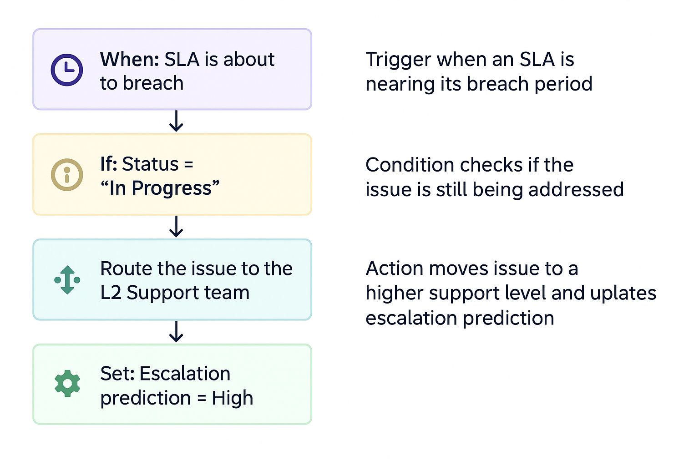
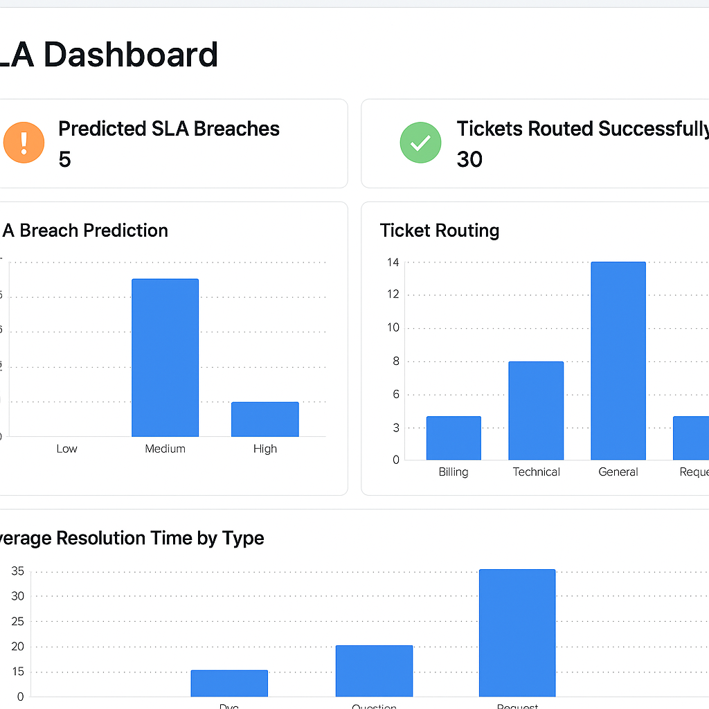
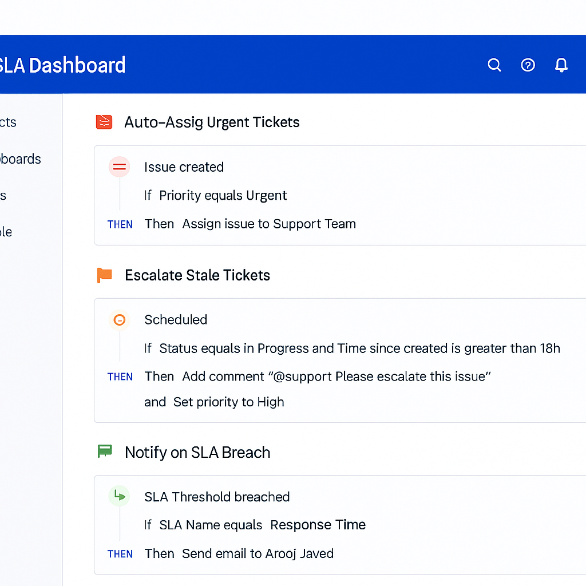
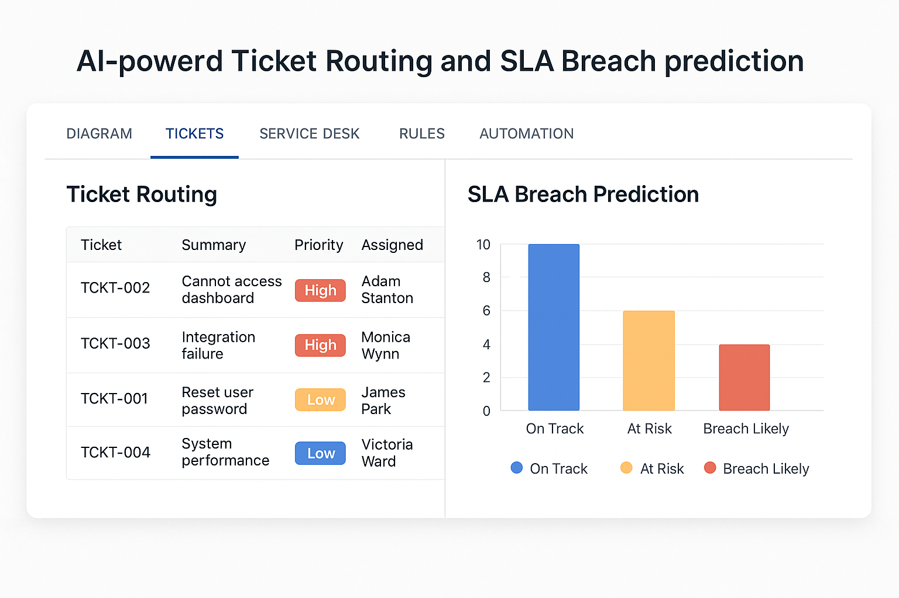

# 🧠 AI-Powered Ticket Routing & SLA Breach Prediction in JIRA

[](LICENSE)
[](https://www.python.org/)
[](#author)

---

 🔍 Project Overview

Managing technical support efficiently in JIRA can be challenging with manual triage and SLA tracking. This project introduces an **AI-powered automation layer** that:

- Auto-routes tickets based on predicted category and severity  
- Predicts SLA breaches before they occur  
- Prioritizes high-risk tickets using rule-based and ML logic  
- Helps teams stay ahead with proactive support operations

🎯 **Goal**: Reduce support delays, improve ticket handling efficiency, and increase SLA adherence through intelligent automation.

---

## 🛠️ Features

- ✅ AI-driven ticket classification based on description & metadata  
- ⏰ Real-time SLA breach prediction based on response patterns  
- 📈 Dashboard-ready data export for team insights  
- ⚙️ Modular Python scripts for plug-and-play usage with JIRA REST API  
- 📥 Works seamlessly with Jira Service Desk projects  

---

## 📚 Published Research

📄 **Title**: *Optimizing Jira-Based Support Operations With AI*  
🗞️ **Journal**: IJARIIT – International Journal of Advance Research, Ideas and Innovations in Technology  
🔗 [Read Full Paper](https://www.ijariit.com/manuscript/optimizing-jira-based-support-operations-with-ai-a-lightweight-framework-for-smart-ticket-routing-and-sla-breach-prediction/)

---

# ✍️ Blog & Article Coverage

📘 **Dev.to Post**  
📝 [AI-Powered Ticket Routing & SLA Prediction in JIRA – My Real-World Automation Journey](https://dev.to/aroojjaved93/ai-powered-ticket-routing-sla-breach-prediction-in-jira-my-real-world-automation-journey-1adb)

📘 **Medium Article**  
📝 [AI-Powered JIRA Ticket Routing & SLA Breach Prediction with Python](https://aroojjaved93.medium.com/ai-powered-jira-ticket-routing-sla-breach-prediction-with-python-d80772a1680c)


---

# 📁 Project Structure

```bash
├── /data/                → Sample datasets & JIRA export files
├── /models/              → Pre-trained classification & prediction models
├── /notebooks/           → Jupyter notebooks for training & evaluation
├── /scripts/             → Python scripts to trigger classification/prediction
├── /api/                 → Flask-based RESTful API for automation
├── /screenshots/         → Sample outputs and workflow screenshots
└── README.md             → Project documentation
```
---

## 📁 Folder Structure

```bash
├── api/                       # Flask app with endpoints
├── automation-rules/          # JSON rules for JIRA
├── dummy-data/                # Sample ticket datasets
├── screenshots/               # Visuals of workflows and dashboards
├── README.md                  # This file
└── requirements.txt           # Python dependencies
```

---

# 🚀 Getting Started

1. Clone the repo  
```bash
git clone https://github.com/your-username/jira-ai-sla-automation.git
cd jira-ai-sla-automation
```

2. Create virtual environment  
```bash
python -m venv venv
source venv/bin/activate  # or venv\Scripts\activate on Windows
```

3. Install dependencies  
```bash
pip install -r requirements.txt
```

4. Run the Flask server  
```bash
python api/app.py
```

---

# 📊 Workflow Overview

### 🔁 Automation Flowchart


### 🧠 SLA Dashboard Preview


### ⚙️ Sample Automation Workflow


### 🚀 Ticket Routing Visual


---

## 📚 Use Cases
```bash
This solution is ideal for:
• IT Support Teams managing SLA-heavy environments
• Product Support Units handling large ticket volumes
• DevOps teams seeking intelligent triage and automation
• Startups and Enterprises using Atlassian JIRA for support workflows
```
⸻

🧠 Tech Stack
```bash
• Python: Core scripting and model orchestration
• Scikit-learn / XGBoost: Model training and tuning
• NLTK / spaCy: Text preprocessing and tokenization
• Flask: Lightweight REST API for integration
• Pandas / Matplotlib / Seaborn: Reporting and analytics
• JIRA REST API: For ticket access and updates
```
---

## 📌 Author

**Arooj Javed**  
Support Engineer | Workflow Automator | Python + JIRA Enthusiast  
GitHub: [@aroojjaved93](https://github.com/aroojJaved93)

---

## 📄 License

This project is licensed under the MIT License.

---

## 🌍 Contributions & Feedback

Stars, forks, and contributions are highly welcome!  
Feel free to create issues or pull requests to suggest improvements.
